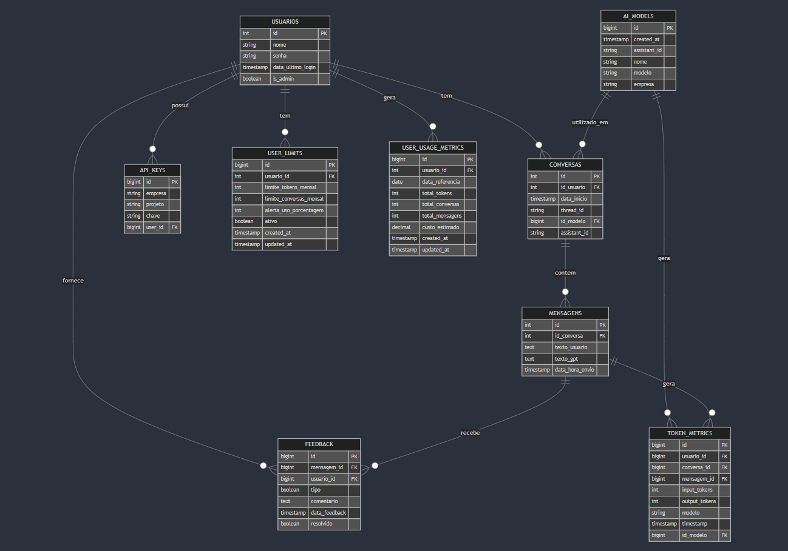

# GeoCarbonite AI Assistant


## 📋 Sobre o Projeto

O GeoCarbonite AI Assistant é uma plataforma avançada de assistência técnica baseada em IA, especializada no diagnóstico e suporte para máquinas agrícolas. O sistema utiliza a API da OpenAI para fornecer diagnósticos precisos e assistência em tempo real.

## 🚀 Funcionalidades Principais

### Autenticação e Controle de Acesso
- Sistema de login seguro com controle de sessão
- Gerenciamento de permissões (usuários normais e administradores)
- Integração com API keys da OpenAI
- Controle de acesso baseado em usuário

### Chat com IA
- Interação em tempo real com assistente especializado
- Suporte a diagnósticos técnicos
- Sistema de feedback para respostas (útil/não útil)
- Histórico completo de conversas
- Exportação de conversas

### Controle de Uso
- Monitoramento de tokens utilizados
- Limites mensais configuráveis por usuário
- Sistema de alertas de uso
- Métricas detalhadas de utilização

### Painel Administrativo
- Dashboard com métricas em tempo real
- Gerenciamento de usuários
- Visualização de conversas e feedbacks
- Configuração de assistentes
- Monitoramento de uso do sistema

### Integrações
- OpenAI API (GPT-4 e modelos relacionados)
- Supabase para armazenamento
- Sistema de arquivos para anexos

## 🛠 Tecnologias Utilizadas

- **Backend**: Python/Flask
- **Frontend**: HTML, CSS, JavaScript
- **Banco de Dados**: PostgreSQL (via Supabase)
- **IA**: OpenAI API
- **Autenticação**: Sistema próprio com sessões
- **Estilização**: CSS personalizado

## 💾 Estrutura do Banco de Dados

O sistema utiliza um banco de dados relacional com as seguintes tabelas principais:

- `USUARIOS`: Gerenciamento de usuários
- `CONVERSAS`: Registro de conversas
- `MENSAGENS`: Armazenamento de mensagens
- `TOKEN_METRICS`: Métricas de uso
- `USER_LIMITS`: Controle de limites
- `FEEDBACK`: Sistema de feedback
- `AI_MODELS`: Configuração de modelos
- `API_KEYS`: Gerenciamento de chaves API



## 🔒 Segurança

- Senhas criptografadas com bcrypt
- Proteção contra SQL Injection
- Validação de sessões
- Controle de acesso por rota
- Gerenciamento seguro de API keys

## 📊 Monitoramento

- Tracking de uso de tokens
- Métricas de satisfação do usuário
- Análise de desempenho dos modelos
- Logs de sistema
- Monitoramento de limites

## 🚀 Como Começar

1. Clone o repositório
2. Instale as dependências:
```bash
pip install -r requirements.txt
```
3. Configure as variáveis de ambiente:
```env
SUPABASE_URL=sua_url
SUPABASE_KEY=sua_key
```
4. Inicie o servidor:
```bash
python app.py
```

## 📝 Configuração de Desenvolvimento

### Requisitos
- Python 3.8+
- PostgreSQL
- Conta OpenAI
- Projeto Supabase

### Variáveis de Ambiente Necessárias
- `SUPABASE_URL`
- `SUPABASE_KEY`
- `FLASK_SECRET_KEY`
- `OPENAI_API_KEY`